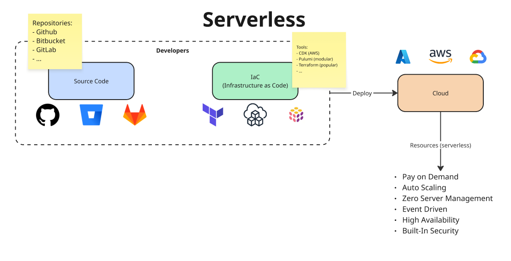
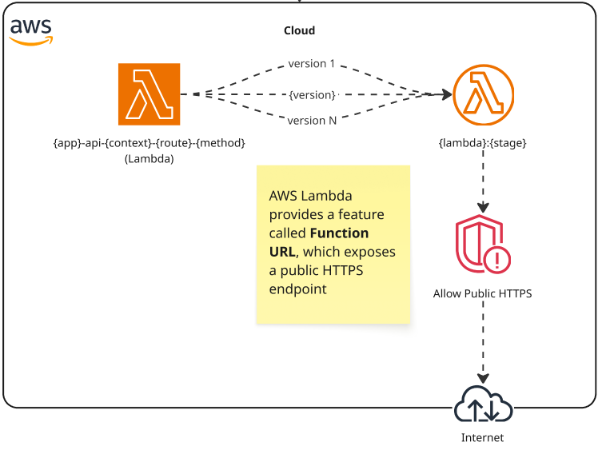
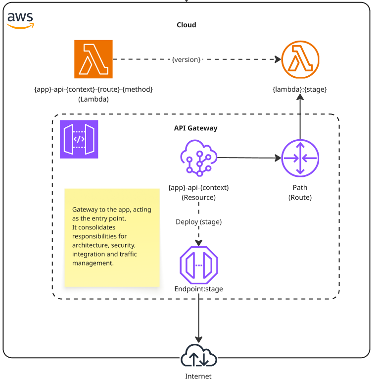
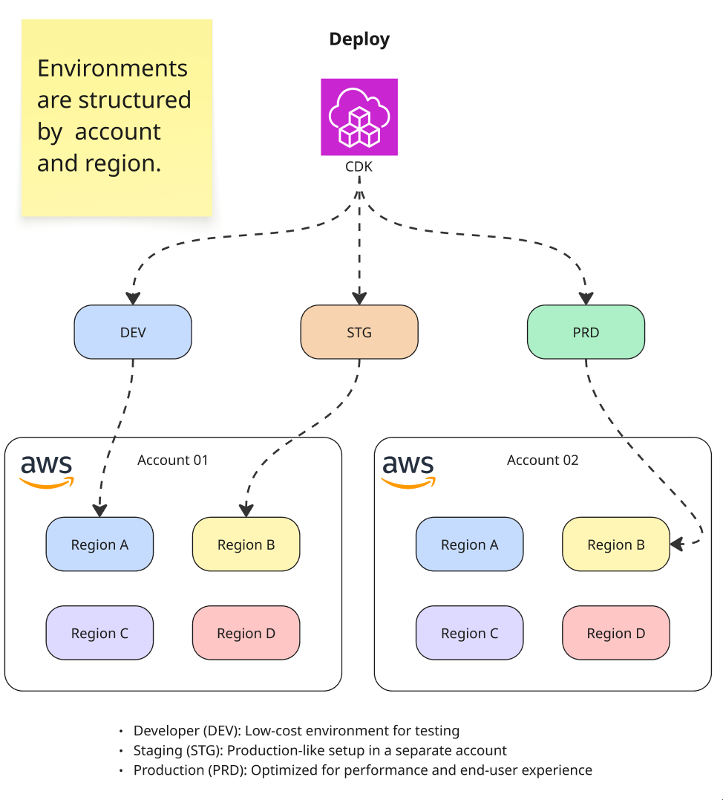

# Step 02 – Serverless Foundations

This step explores the foundations of **Serverless applications** on AWS, using **Lambda**, **Alias**, and **API Gateway**.
The goal is not only coding, but **understanding the resources** and the **reason behind each choice**.

---

## 📌 What is Serverless?

* You don’t manage servers.
* You pay **on demand** (only when the function runs).
* Highly scalable, resilient, and cost-efficient.

---

## 🛠️ Infrastructure as Code (IaC) Tools

* **CDK (AWS)** → Native, code-driven.
* **Pulumi** → Modular, multi-cloud.
* **Terraform** → Most adopted, declarative.

All allow managing cloud infrastructure as **code** instead of manual setup.

---

## 🧩 Main Resources

### 🟦 AWS Lambda

* A compute service that runs functions in isolated **containers**.
* You deploy only the code, and AWS manages infrastructure, scaling, and runtime.
* Ideal for event-driven architectures.

### 🟩 Alias

* Works as a **pointer** to a specific Lambda version.
* Makes it **super easy to rollback** to a previous version.
* Enables safe deployments (dev, stg, prod).

### 🟨 IAM Roles

* Define what a Lambda can or cannot do.
* Provide least-privilege access to other AWS services.
* Essential for security and compliance.

---

## 🌐 Public Access

### Function URL

* A feature that allows **direct public access** to a Lambda function.
* Useful for quick tests or demos, but limited in features.

### API Gateway (recommended)

* Becomes the **entry point** of the application.
* Provides:

  * ✅ Authentication
  * ✅ Security & Protection
  * ✅ Metrics & Logs
  * ✅ Integration with private VPC resources

---

## 📊 Why API Gateway Instead of Function URL?

* Function URL = simple, fast, but limited.
* API Gateway = **robust**, centralizing security, observability, and integrations.
* Plays a **key architectural role** as the application’s front door.

---

## 🚀 Deployment Flow

We define three environments to ensure safe delivery:

* **Dev** → Experimental changes.
* **Stg** → Pre-production validation.
* **Prd** → Stable environment for users.

---