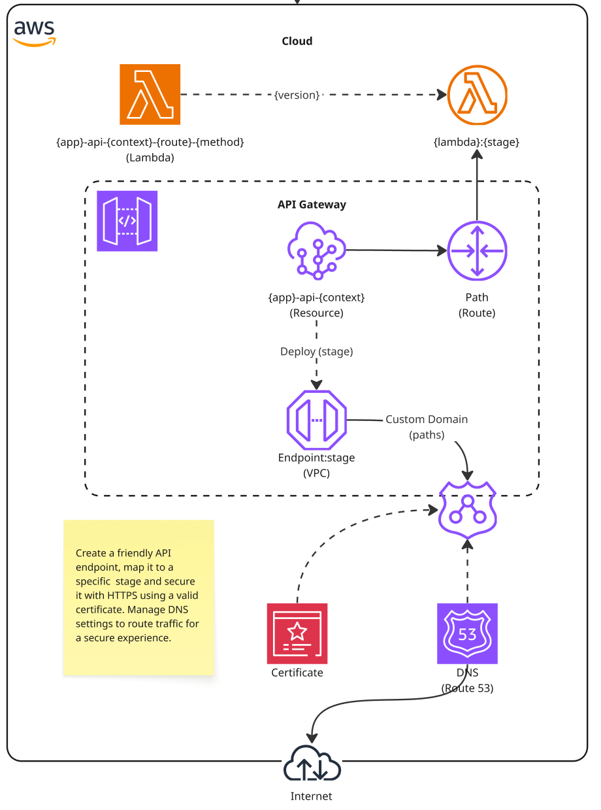

# Step 03 – API Gateway Custom Domain

This step focuses on configuring a **Custom Domain** in **AWS API Gateway**, making your serverless API accessible through a friendly and professional URL.  
The objective is to understand the **why** and **how** of custom domains, including certificates, mappings, and DNS integration.  

---

## 📌 Why Use a Custom Domain?

* Provides a **branded and trusted URL** (e.g., `api.mycompany.com` instead of AWS default).  
* Ensures **HTTPS/TLS** encryption with certificates from **AWS Certificate Manager (ACM)**.  
* Organizes multiple APIs and versions under a single domain using **Base Path Mapping**.  
* Makes it easier to evolve APIs without breaking clients.  

---

## 🧩 Key Concepts

### 🟦 Endpoint Types

* **Edge-Optimized** → Better global latency, requires certificate in **us-east-1**.  
* **Regional** → Best for clients in the same region, certificate must exist in that region.  

---

### 🟩 Certificates (ACM)

* Managed by **AWS Certificate Manager**.  
* Supports auto-renewal of public SSL/TLS certificates.  
* Validation is usually done through **DNS records**.  

---

### 🟨 Base Path Mapping

* Maps a **Custom Domain → API Gateway API → Stage**.  
* Example:  
  * `https://api.mycompany.com/v1/orders` → API Orders (stage `prod`)  
  * `https://api.mycompany.com/v1/auth` → API Auth (stage `prod`)  

---

### 🟥 DNS Integration

* Configure DNS in **Amazon Route 53** (or external DNS provider).  
* Create an **ALIAS or CNAME** record pointing the subdomain (e.g., `api.mycompany.com`) to the API Gateway domain.  

---

## 📊 Benefits of a Custom Domain

* Centralized entry point for all APIs.  
* Flexibility to version APIs (`/v1`, `/v2`) without changing the base domain.  
* Easier integration with frontend and partner systems.  
* Improves credibility with a secure and professional URL.  

---